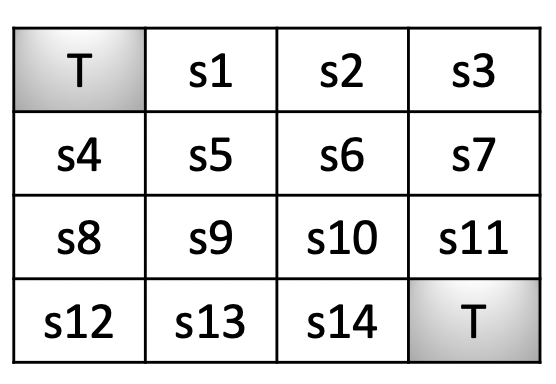

# Assignment Statement

Given the following Grid World problem.

_**States**_:
- _Terminal_: There are two terminal states, denoted by **T**
- _Non-Terminal_: There are 14 non-terminal states, **s1** to **s14**

_**Rewards**_:
- For non-terminal states: **-1**
- For terminal states: **0**

_**Optimal Policy**_:

_**Note**_:
- At each state, given best direction (from optimal policy) is chosen, it moves to the desired direction with a probability **0.7**.
Moves to other states with equal probability.
- States in which there are two optimal directions, both are chosen with equal probability.
- Initial state for an episode is chosen with equal probability among **14** states.
- As these are episodic tasks, consider discount factor (**&gamma;**) to be **1**.

#### Questions

1. Apply `Monte Carlo first visit` method , averaged over **1000** independent runs to estimate **V&pi;(s)** for states **s1** - **s14**.
2. Repeat the above step with `Monte Carlo every visit` method.
